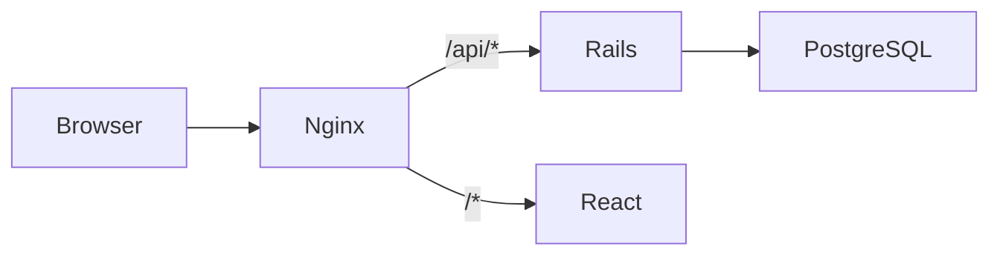

# Rails Demo — Full-Stack Production Starter working demo

Rails 7 API + React (Vite) + PostgreSQL + JWT auth, containerized with Docker and deployable to AWS EC2 via GitHub Actions.

## Project structure

```
backend/          # Rails 7 API-only app
frontend/         # React + Vite SPA (Nginx in production)
nginx/            # Nginx documentation (config lives in frontend/nginx)
docker-compose.yml
.github/workflows/deploy.yml
```

## Tech stack

| Layer | Stack |
|-------|--------|
| Backend | Ruby on Rails 7.1 (API), PostgreSQL, JWT (`jwt` gem), `bcrypt` |
| Frontend | React 19, Vite, Axios, React Router |
| Infra | Docker Compose, Nginx reverse proxy, GitHub Actions, EC2 |

---

## Local setup (without Docker)

### Prerequisites

- Ruby 3.2+
- Node.js 22+
- PostgreSQL 16+

### Backend

```bash
cd backend
cp .env.example .env
bundle install
bin/rails db:create db:migrate db:seed
bin/rails server
```

API runs at `http://localhost:3000`.

### Frontend

```bash
cd frontend
cp .env.example .env
npm install
npm run dev
```

App runs at `http://localhost:5173` with Vite proxying `/api` to Rails.

---

## Docker run (recommended)

### 1. Configure environment

```bash
cp .env.example .env
```

Edit `.env` and set strong values for `JWT_SECRET` and `SECRET_KEY_BASE`.

### 2. Start the stack

```bash
docker compose up --build
```

| Service | URL |
|---------|-----|
| Frontend (Nginx) | http://localhost |
| API (via proxy) | http://localhost/api |

### 3. Database

Migrations run automatically on backend startup via `docker-entrypoint.sh` (`rails db:prepare`).

Seed demo data (optional):

```bash
docker compose exec backend bundle exec rails db:seed
```

Demo user: `demo@example.com` / `password123`

---

## API endpoints

All authenticated routes require header: `Authorization: Bearer <token>`

### Auth

| Method | Path | Body | Description |
|--------|------|------|-------------|
| POST | `/api/signup` | `{ "user": { "name", "email", "password" } }` | Register, returns JWT |
| POST | `/api/login` | `{ "user": { "email", "password" } }` | Login, returns JWT |

### User

| Method | Path | Description |
|--------|------|-------------|
| GET | `/api/me` | Current user profile |

### Posts (scoped to current user)

| Method | Path | Description |
|--------|------|-------------|
| GET | `/api/posts` | List own posts |
| POST | `/api/posts` | Create post |
| GET | `/api/posts/:id` | Show own post |
| PUT | `/api/posts/:id` | Update own post |
| DELETE | `/api/posts/:id` | Delete own post |

Example signup:

```bash
curl -X POST http://localhost/api/signup \
  -H "Content-Type: application/json" \
  -d '{"user":{"name":"Jane","email":"jane@example.com","password":"password123"}}'
```

---

## Environment variables

| Variable | Description |
|----------|-------------|
| `JWT_SECRET` | Secret for signing JWTs |
| `SECRET_KEY_BASE` | Rails secret key base |
| `DATABASE_HOST` | Postgres host (`postgres` in Docker) |
| `DATABASE_USERNAME` | DB user (default `postgres`) |
| `DATABASE_PASSWORD` | DB password (default `postgres`) |
| `DATABASE_NAME` | Database name |
| `RAILS_ENV` | `development`, `test`, or `production` |
| `VITE_API_URL` | Frontend API base path (default `/api`) |

---

## Nginx routing

Configured in `frontend/nginx/default.conf`:

- `/` → React static files (SPA fallback to `index.html`)
- `/api/*` → Rails backend (`/api` prefix stripped)

---

## CI/CD (GitHub Actions)

Workflow: `.github/workflows/deploy.yml`

### On every push / PR to `main`

1. Run Rails tests (with Postgres service)
2. Run frontend Vitest suite

### On push to `main` (after tests pass)

1. Build and push Docker images to Docker Hub
2. SSH into EC2 and run `scripts/ec2-bootstrap.sh`, which on a **new machine** automatically:
   - Installs `git`, `curl`, and Docker (Ubuntu/Debian **or** Amazon Linux)
   - Installs Docker Compose if missing
   - Logs in to Docker Hub
   - Clones/updates the repo and starts `docker compose -f docker-compose.prod.yml`

### Required GitHub secrets

| Secret | Description |
|--------|-------------|
| `DOCKERHUB_USERNAME` | Docker Hub username |
| `DOCKERHUB_TOKEN` | Docker Hub access token (pull private images on EC2) |
| `EC2_HOST` | EC2 public IP or hostname |
| `EC2_USER` | SSH user (`ubuntu` on Ubuntu AMI, `ec2-user` on Amazon Linux) |
| `EC2_SSH_KEY` | Private SSH key (PEM contents, not `authorized_keys`) |
| `JWT_SECRET` | Production JWT secret |
| `SECRET_KEY_BASE` | Production Rails secret |
| `DEPLOY_GITHUB_TOKEN` | Optional: GitHub PAT to clone **private** repos on EC2 |

---

## Production deployment (AWS EC2)

### 1. Launch EC2 instance

- AMI: **Ubuntu 24.04 LTS**
- Instance type: `t3.small` or larger
- Storage: 20 GB+

### 2. Security group

| Port | Protocol | Source | Purpose |
|------|----------|--------|---------|
| 22 | TCP | Your IP | SSH |
| 80 | TCP | 0.0.0.0/0 | HTTP |
| 443 | TCP | 0.0.0.0/0 | HTTPS |
| 3000 | TCP | Optional | Direct API debug only (not required behind Nginx) |

### 3. First deploy (automated)

On a **fresh** EC2 instance you only need:

1. Security group (step 2)
2. GitHub secrets configured (see CI/CD section)
3. Push to `main` — the deploy job installs dependencies, clones the repo, and starts the stack

Manual setup (optional debugging):

```bash
ssh ubuntu@<EC2_HOST>   # or ec2-user@<EC2_HOST> on Amazon Linux
cd ~/rails_demo && git pull
export JWT_SECRET=... SECRET_KEY_BASE=... DOCKERHUB_USERNAME=... DOCKERHUB_TOKEN=...
bash scripts/ec2-bootstrap.sh
```

Visit `http://<EC2_PUBLIC_IP>`.

### 4. Domain + HTTPS (recommended)

Point your domain A record to the EC2 IP, then on EC2:

```bash
sudo apt-get install -y certbot
sudo certbot certonly --standalone -d yourdomain.com
```

Mount certificates into Nginx (extend `frontend/nginx/default.conf` with SSL `listen 443 ssl` and certificate paths), or place a host-level Nginx/Caddy reverse proxy in front of the container.

---

## Development commands

```bash
# Backend tests
cd backend && bundle exec rails test

# Frontend tests
cd frontend && npm test

# RuboCop (optional)
cd backend && bundle exec rubocop
```

---

## Architecture



---

## License

MIT
